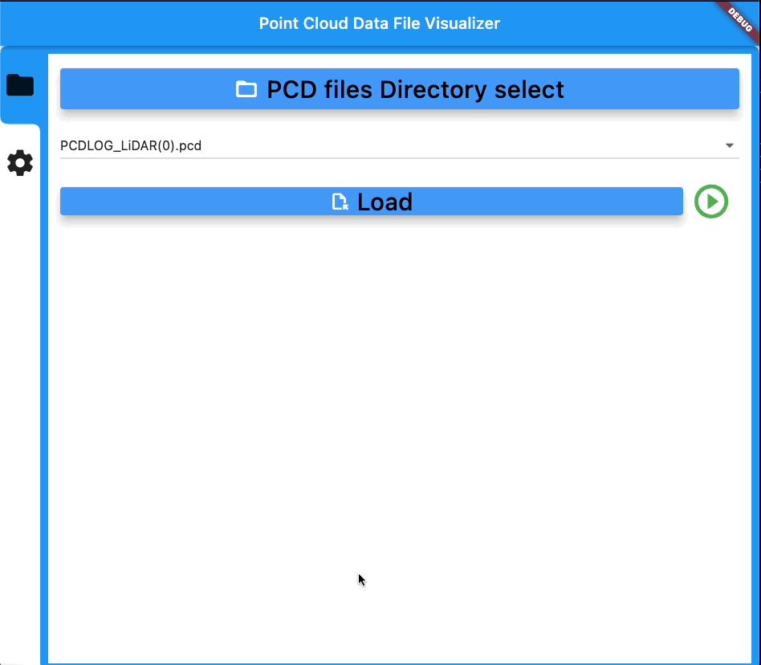
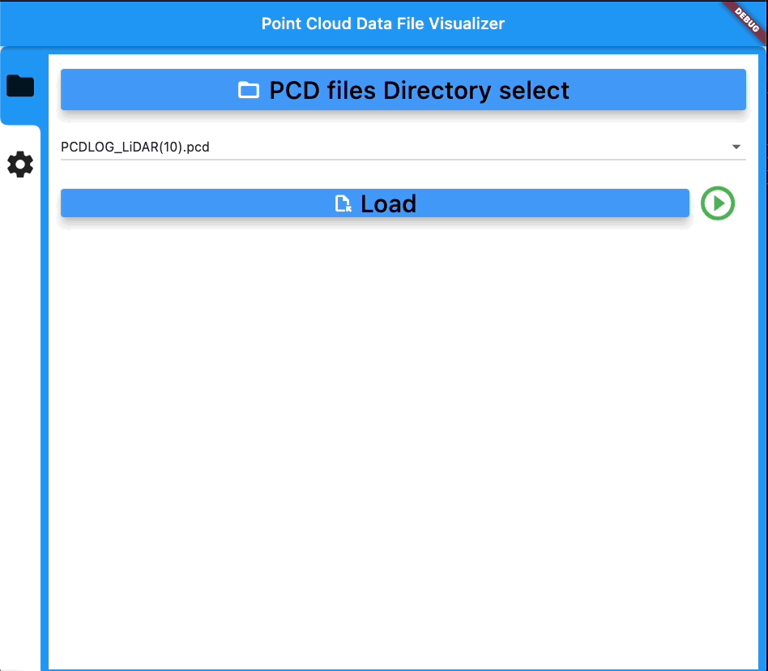
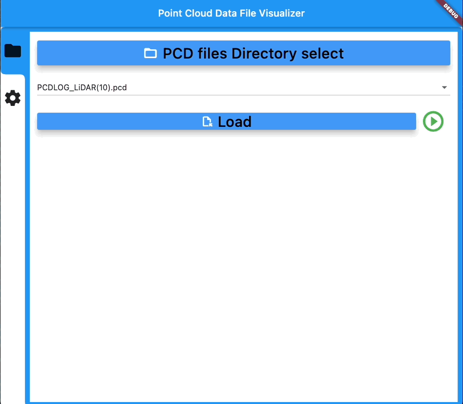
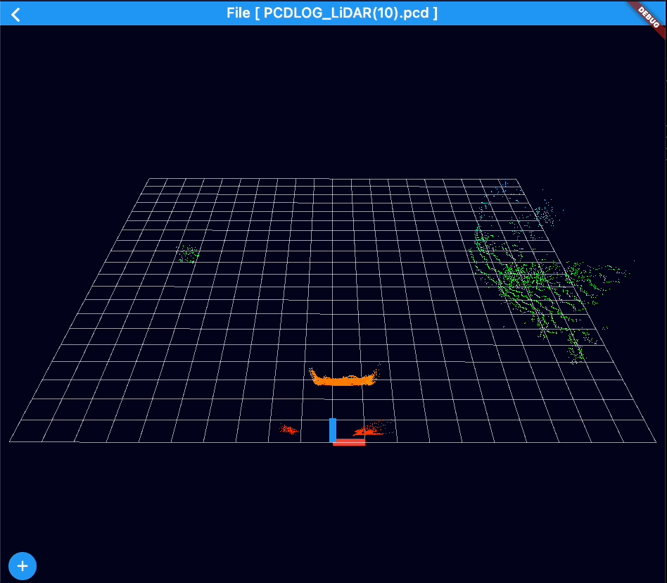
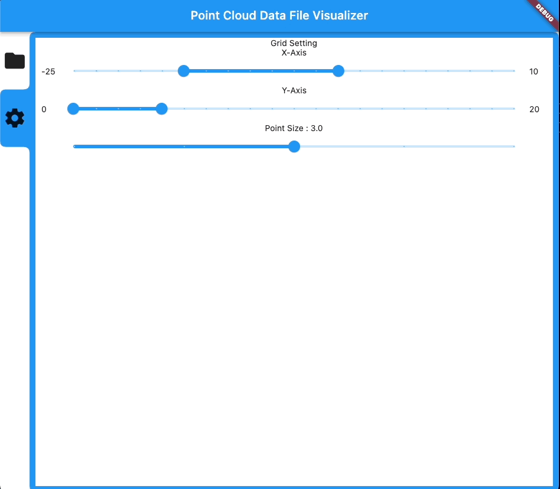
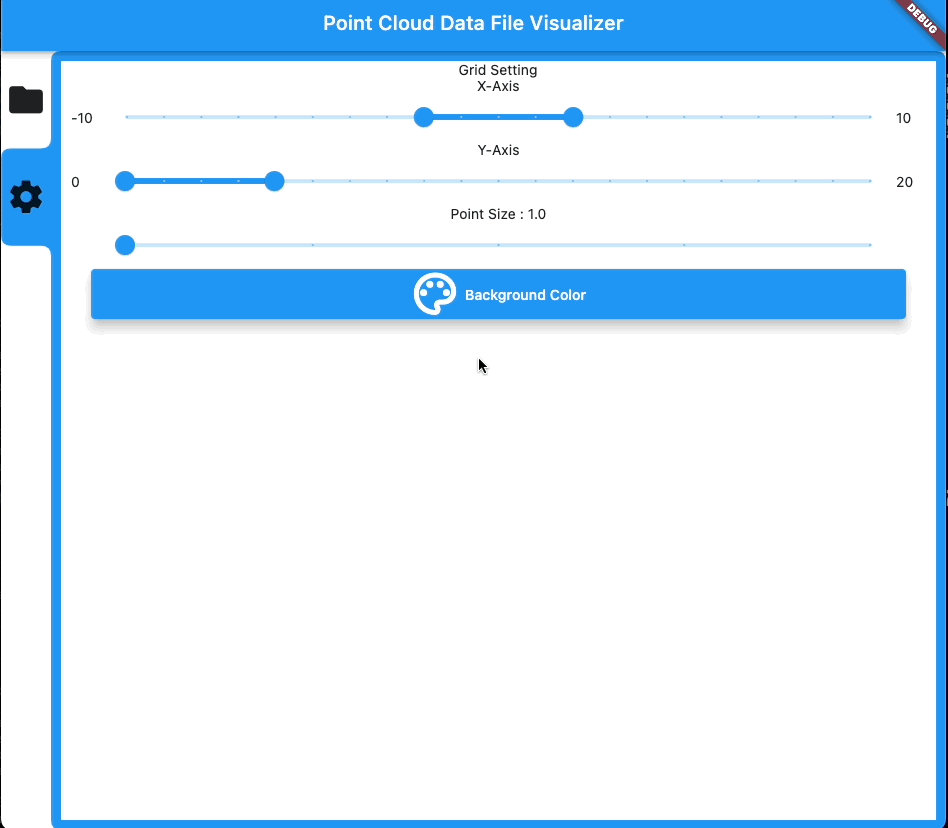

# PointCloudData Viewer

My first Flutter application was done!
This Flutter project is for Point Cloud Data(PCD) Visualizer.

## Point Cloud Data file format

- [point cloud library](https://pointclouds.org/)
- [PCD format](https://pointclouds.org/documentation/tutorials/pcd_file_format.html)
  - only ASCii
  - XYZ
  - XYZRGB

## used package list

1. [ditredi](https://pub.dev/packages/ditredi)
   1. [vector_math](https://pub.dev/packages/vector_math)
2. [file_picker](https://pub.dev/packages/file_picker)
3. [path_provider](https://pub.dev/packages/path_provider)
4. [sidebarx](https://pub.dev/packages/sidebarx)
5. [tab_container](https://pub.dev/packages/tab_container)
6. [flutter_colorpicker](https://pub.dev/packages/flutter_colorpicker)

## Rebuild

```bash
flutter clean project
flutter pub get
```

## result

- in Mac OS

### File Select



### Basic Visualization



#### Play PCD Files



### Point Size



### Change Viewer Configuration

#### Grid & Point Size




#### Background Color


