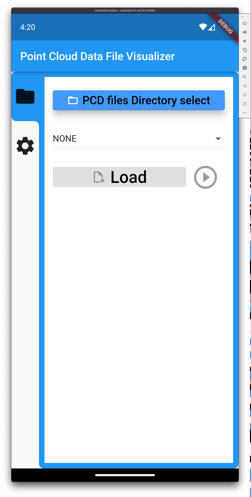

# PointCloudData Viewer

My first Flutter application was done!
This Flutter project is for Point Cloud Data(PCD) Visualizer.

## Point Cloud Data file format

- [point cloud library](https://pointclouds.org/)
- [PCD format](https://pointclouds.org/documentation/tutorials/pcd_file_format.html)
  - only ASCii
  - XYZ
  - XYZRGB

## Platform

|         | windows               | MacOS              | Android            | iOS                   |
| ------- | --------------------- | ------------------ | ------------------ | --------------------- |
| support | :black_square_button: | :white_check_mark: | :white_check_mark: | :black_square_button: |

## Package List

1. [ditredi](https://pub.dev/packages/ditredi)
   1. [vector_math](https://pub.dev/packages/vector_math)
2. [file_picker](https://pub.dev/packages/file_picker)
3. [path_provider](https://pub.dev/packages/path_provider)
4. [sidebarx](https://pub.dev/packages/sidebarx)
5. [tab_container](https://pub.dev/packages/tab_container)
6. [flutter_colorpicker](https://pub.dev/packages/flutter_colorpicker)
7. [permission_handler](https://pub.dev/packages/permission_handler/example)

## Rebuild

```bash
flutter clean project
flutter pub get
```

### Permission

#### macOS

```bash
/[project-path]/macos/Runner/DebugProfile.entitlements
```

- add permision : file read/write

```json
<key>com.apple.security.files.user-selected.read-write</key>
```

#### Android

```bash
# /[project-path]/android/gradle.properties
# add this command
android.useAndroidX=true
android.enableJetifier=true
#============================================
```

```bash
/[project-path]/android/app/src/debug/AndroidManifest.xml
```

- add permision : file read/write

```json
    <!-- Permissions options for the `storage` group -->
    <uses-permission android:name="android.permission.READ_EXTERNAL_STORAGE"/>
    <uses-permission android:name="android.permission.WRITE_EXTERNAL_STORAGE"/>

    <!-- Permissions options for the `manage external storage` group -->
    <uses-permission android:name="android.permission.MANAGE_EXTERNAL_STORAGE" />
```

## RESULT

### MacOS

#### File Select


#### Basic Visualization


##### Play PCD Files


#### Point Size


#### Change Viewer Configuration

##### Grid & Point Size


##### Background Color


### Android

|                                    start                                    |                                  file selet                                   |                                 visualization                                 |
| :-------------------------------------------------------------------------: | :---------------------------------------------------------------------------: | :---------------------------------------------------------------------------: |
|  |  |  |
